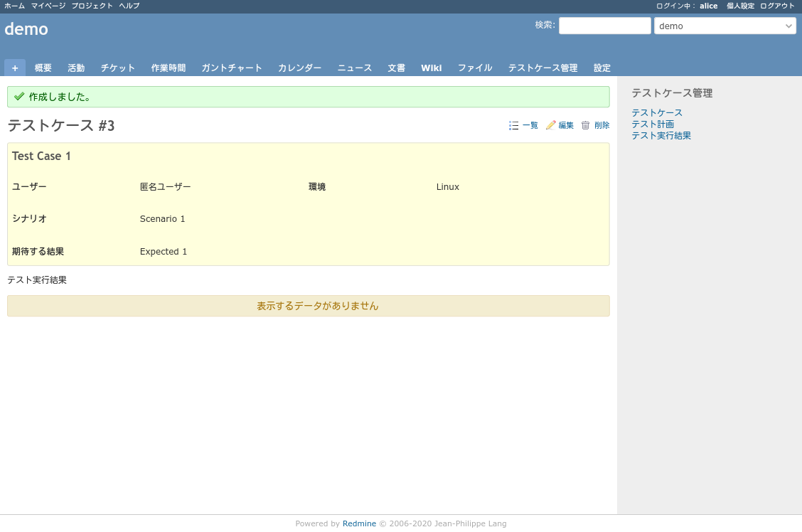
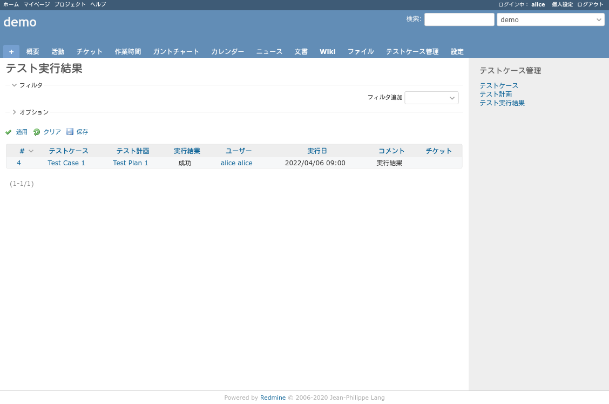

# プラグインスクリーンショット画面

## トップのテストケース管理をクリックしたときの画面

## 新しいテストケースを作成するときの画面

## 新しいテストケースを作成したときの画面(テストケース詳細)

## まだテスト計画していないときの画面

## 新しいテスト計画を作成するときの画面

## テスト計画にテストケースをひもづけるときの画面

## テスト計画にテストケースをひもづけたときの画面

## 新しくテスト実行結果を作成するときの画面

## テスト実行結果詳細表示画面

## テスト計画一覧画面

## テストケース一覧画面

## テスト実行結果一覧画面

