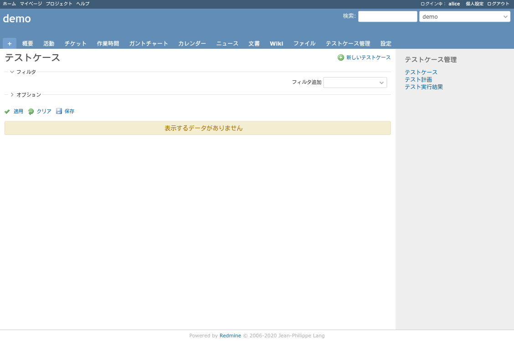

# プラグインスクリーンショット画面

## トップのテストケース管理をクリックしたときの画面

## 新しいテストケースを作成するときの画面

## 新しいテストケースを作成したときの画面(テストケース詳細)

## まだテスト計画していないときの画面

## 新しいテスト計画を作成するときの画面

## テスト計画にテストケースをひもづけるときの画面

## テスト計画にテストケースをひもづけたときの画面

## 新しくテスト実行結果を作成するときの画面

## テスト実行結果詳細表示画面

## テスト計画一覧画面

## テストケース一覧画面

## テスト実行結果一覧画面

## v1.6.6 での改善点

### 修正された問題
* **ページネーション表示の修正**: テスト計画詳細ページのテストケースページネーション表示で、実際の件数と異なる件数が表示される問題を修正しました（例：1-12/12 → 1-6/6）
* **テスト計画リンクの修正**: テストケースページでテスト計画リンクをクリックした際に「プロジェクトが見つかりません」エラーが発生する問題を修正しました
* **CSVエクスポートの修正**: テスト計画のCSVエクスポートで重複カラムが表示される問題を修正しました
* **テスト計画インポートの修正**: テスト計画のインポート時にレコードの新規作成・更新が失敗する問題を修正しました

### 技術的改善
* **クエリ最適化**: TestCaseQueryのtest_case_countメソッドを最適化し、より正確な件数表示を実現
* **データ整合性**: TestCaseモデルのwith_latest_resultスコープにdistinctを追加し、重複レコードを防止
* **URL生成の統一**: プロジェクト名ではなくプロジェクト識別子を統一して使用し、ルーティングの正確性を確保